# Automated Image Builder with Jenkins, Packer, and Kubernetes
In this tutorial you will deploy a fully-functional implementation of the automated image building pipeline described in the [Automated Image Builds with Jenkins, Packer, and Kubernetes solution paper](https://cloud.google.com/solutions/automated-build-images-with-jenkins-kubernetes).

You will use [Google Container Engine](https://cloud.google.com/container-engine/) and [Kubernetes](http://kubernetes.io) to deploy the environment. It will resemble this digram when you're done

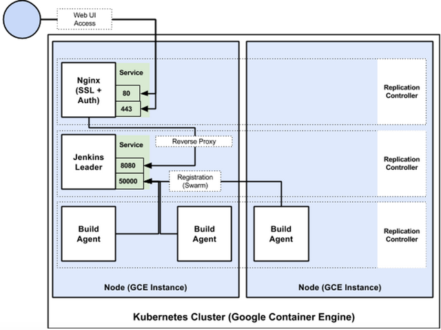

<a name="very-important-things"></a>
## Very Important Things
If you follow these instructions exactly, you will deploy (2) g1-small GCE instances and a network load balancer, all resources that are billed for. It is very important that you follow the instructions to turn down the cluster if you do not want to continue to be billed for these resources. [This calculator quote](https://cloud.google.com/products/calculator/#id=4539f510-f60f-4479-a686-5a4a37896368) provides an estimate of the monthly cost of the resources provisioned in this example.

Be sure to create a brand new project for this tutorial (instructions are in the deploy sections below). Also be sure to complete the [Delete the Deployment](#delete-the-deployment) section when you're done. It's super quick and will tear down everything you created.

## Conventions
The instructions in this tutorial assume you have access to a terminal on a Linux or OS X host. For Windows hosts, [Cygwin](http://cygwin.com/) should work.

You will need to enter commands in your terminal. Those commands are indicated in the following format, where `$` indicates a prompt (do not paste the $ into your terminal, just everything that follows it):

```shell
$ echo "This is a sample command"
```
## Deploy
### Deployment Requirements
Before you deploy the sample you'll need to make sure a few things are in order:
 
1. Create a new project in the [Google Developer Console](https://console.developers.google.com/project) and note the new project's ID.

1. In the [APIs & Auth section of the Google Developers Console](https://console.developers.google.com/project/_/apiui/api) of your new project, enable the following APIs:

    * Google Compute Engine
    * Google Container Engine API 

1. Install the Cloud SDK using [these instructions](https://cloud.google.com/sdk/).

1. Authenticate to gcloud:

    ```shell
    $ gcloud auth login
    ```

1. Set your project:

    ```shell
    $ gcloud config set project YOUR_PROJECT_ID
    ```

1. Enable `alpha` features:

    ```shell
    $ gcloud components update alpha
    ```

1. If you are using Windows to complete the tutorial, install [Cygwin](http://cygwin.com/) and execute the steps in a terminal.

<a name="quick-deploy"></a>
### Quick Deploy
These quick deploy instructions are easiest way to get started. The work to create a Google Container Engine cluster and launch the necessary Kubernetes resources is captured in the `cluster_up.sh` script.

To quick deploy the image builder application:

1. Clone this repository or download and unzip a [copy from releases](https://github.com/GoogleCloudPlatform/kube-jenkins-imager/releases).

1. Navigate to the directory:
 
    ```shell
    $ cd kube-jenkins-imager 
    ```

1. Copy `ssl_secrets.template.json` to `ssl_secrets.json`. The latter is included in `.gitignore` to prevent committing secret information to Git:

    ```shell
    $ cp ssl_secrets.template.json ssl_secrets.json
    ```
<a name="ssl-setup"></a>
1. **Optional, but very strongly encouraged:** You can configure SSL termination to encrypt the connection between your browser and Jenkins. For a production configuration, consider this step mandatory. To configure SSL:


     * base64-encode both your certificate and key file:
  
        ```shell
        $ base64 -i STAR_yourdomain_com.crt
          LS0tLS1CRUdJTiBDRVJUSUZJQ0FURS...
        ```

        ```shell
        $ base64 -i STAR_yourdomain_com.key
          LS0tLS1CRUdJTiBDRVJUSUZJQ0FURS...
        ```

    * Paste the output of each into the correct location in `ssl_secrets.json`:

        ```javascript
        "data": {
          ...
          "proxycert": "YOUR_BASE64_ENCIDED_CERT",
          "proxykey": "YOUR_BASE64_ENCIDED_CERT"",
          ...
        }
        ```

    * Generate a DHE Parameter to ensure a secure SSL setup;

        ```shell
        $ openssl dhparam -out dhparam.pem 2048
        ```

    * base64 encode it:

        ```shell
        $ base64 -i dhparam.pem
        ```

    *  Add the encoded value to `ssl_secrets.json`. A complete `ssl_secrets.json` would resemble:

        ```javascript
         {
          "apiVersion": "v1beta3",
          "kind": "Secret",
          "metadata": {
            "name": "ssl-proxy-secret",
            "namespace": "default"
          },
          "data": {
            "htpasswd": "amVua2luczokYXByMSRDaW9MaWhUOSRzZEh3dGRDLlFaRjdPUTRzQ1BoaEgwCg==",
            "proxycert": "LS0tLS1CRUdJTiBDRVJU...",
            "proxykey": "LS0tLS1CRUdJTiBDRVJU...",
            "dhparam": "LS0tLS1CRUdJTiBESCBQQVJBTUVU..."
          }
        } 
        ```

    * Finally, modify modify `ssl_proxy.json` and change the `ENABLE_SSL` value to `true`:

        ```shell
        ...
        { 
          "name": "ENABLE_SSL",
          "value": "true"
        },
        ...
        ```
<a name="customize-password"></a>
1. **Optional, but very strongly encouraged:** To customize the basic access authentication credentials used to access the Jenkins UI, use `htpasswd` piped through `base64` to create a new credential, then paste the output into the correct location in `ssl_secrets.json`: 
  
    ```shell       
    $ htpasswd -nb USERNAME PASSWORD | base64
    ```
      
    Alternatively, you can base64-encode an existing `.htpasswd` file and add it to `ssl_secrets.json` 

1. From a terminal in the directory you cloned or unzipped, run:

    ```shell
    $ ./cluster_up.sh
    ```

     The script will take several minutes to complete. The abbreviated output should look similar to:

      ```shell
      Creating cluster imager...done.
      ...
      ...
      <TRUNCATED>
      ...
      ...
      Jenkins will be available at http://104.197.35.131 shortly... 
      ```
1. Continue to the [Access Jenkins](#access-jenkins) section (skip the Stepwise Deploy section)

<a name="stepwise-deploy"></a>  
### Stepwise Deploy
You can find open the `cluster_up.sh` script and execute the commands from each line for a closer look at everything that's taking place.

<a name="access-jenkins"></a>
## Access Jenkins
1. Access the URL output when you created your deployment. You should be prompted to authenticate. Unless you disabled or customized your `.htpasswd`, the username and password is `jenkins`:

    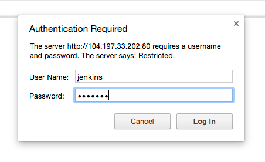

    > **Troubleshooting:** Keep in mind that it may take a few minutes to download the Docker images required to run the application, even though the load balancer is ready. It is possible that the Nginx reverse proxy is not ready, and your browser will display an output similar to:
    >
    > 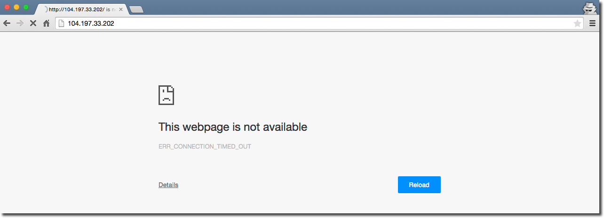
    >
    > It is also possible that the Nginx reverse proxy is working, but Jenkins isn't ready yet. In that case, you'll receive an authentication prompt, but receive a **502 Bad Gateway** response from Nginx:
    >
    > 
    >
    > In either case, give the cluster a few more minutes to finish downloading the initial Docker images and try again.

1. After a successful login you should see the Jenkins admin landing page with a default backup job:

    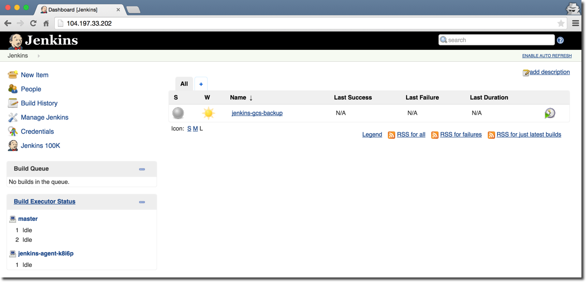

## Configure Jenkins
In the following sections you will create a credential, define and run an image build job, and backup the Jenkins configuration.

### Create Credentials
1. **Optional:** Configure a Jenkins login (in addition to the basic access authentication at the reverse proxy) by navigating to **Manage Jenkins >> Configure Global Security** and configuring authentication and authorization settings to your requirements

1. Create a credential by clicking on the **Credentials** link in the left nav, then clicking the **Global credentials** link:

    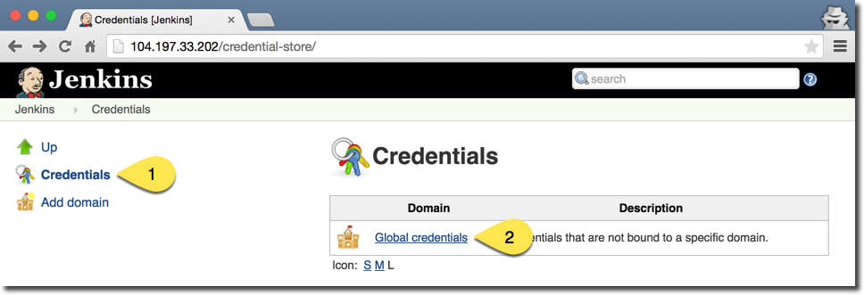

1. Click **Add Credentials** in the left nav, choose `Google Service Account from metadata` in the **Kind** dropdown, and click **OK**. The Project Name will be auto-populated:

    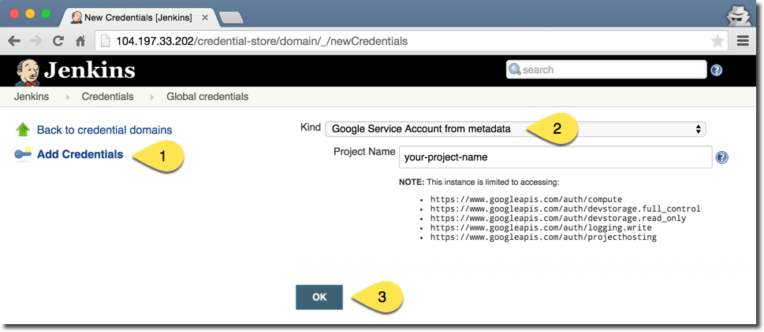

### Create and Run a Build Job
In the following sections you will clone an existing repo (from the previous [Scalable and Resilient Web Applications](https://github.com/GoogleCloudPlatform/scalable-resilient-web-app) tutorial that includes a working build configuration. You will then push that repo to your project's Cloud Repository, create a Jenkins job to build it, and run the job.

#### Replicate a GitHub Repo
1. Clone the existing sample repository to your workstation (you must have `git` installed) and go into the new directory:

    ```shell
    $ git clone https://github.com/GoogleCloudPlatform/scalable-resilient-web-app.git
    $ cd scalable-resilient-web-app
    ```

1. In the [Google Developer Console](https://console.developers.google.com/), navigate to **Source Code > Browse**, click "Get started" then choose "Push code from a local Git repository to your Cloud Repository", and follow all of the instructions to push the `scalable-resilient-web-app` to your Cloud Repository.

1. Click the **Browse** menu item again, confirm your files are there, then click the gear icon:

    

1. Click the settings icon, and copy your repository's URL. You'll need it in the next step:

    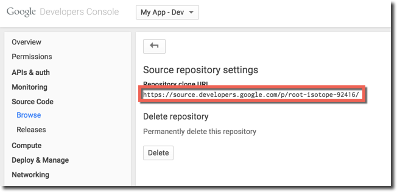

#### Create Jenkins Job
1. Access Jenkins in your browser. If you don't remember the URL, you can run the following command in the terminal where you created the deployment to find it:

    ```shell
    $ echo "http://$(gcloud compute forwarding-rules list --regexp "k8s-imager-default-nginx-ssl-proxy" | tail -n +2 | cut -f3 -d' ')"
    ```

1. From the Jenkins main page, choose **New Item*, name the item `redmine-immutable-image`, choose **Freestyle project**, then click **OK**. It is important the name does not include spaces:

    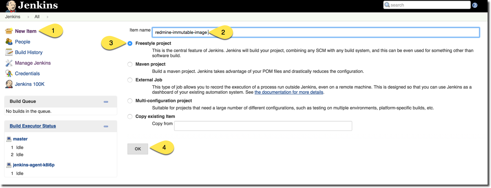

1. Check **Restrict where this project can be run** and use `gcp-packer` as the label expression to ensure the job runs on the correct build agents:

    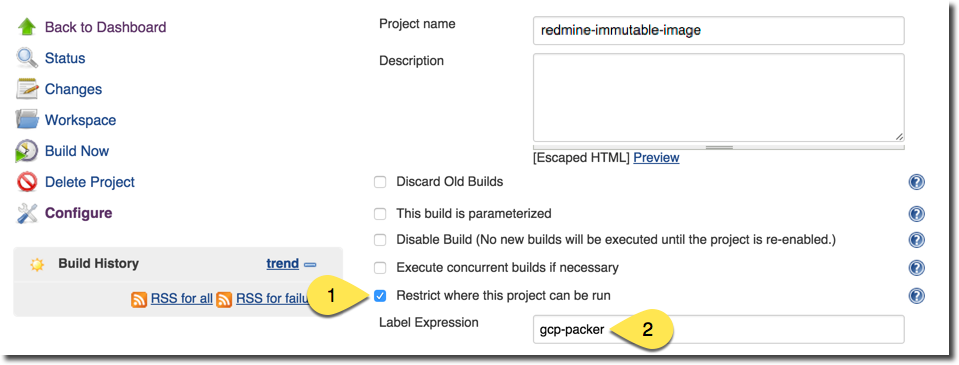

1. Under **Source Code Management**, choose Git, paste your Cloud Repository URL from the previous section, and choose the credential you created earlier from the dropdown:

    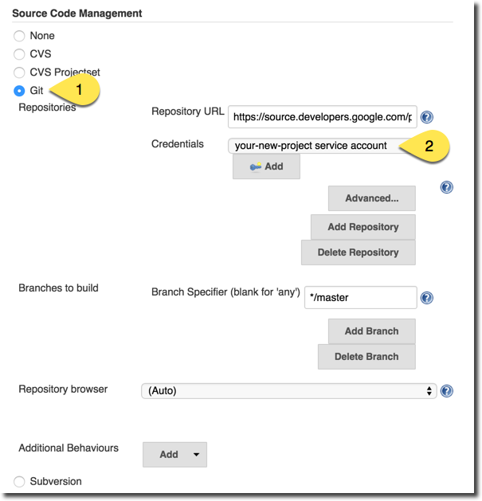

1. Under **Build Triggers**, choose Poll SCM and enter a value for Schedule. In this example, `H/5 * * * *` will poll the repository every 5 minutes. Choose a value that you consider appropriate:

    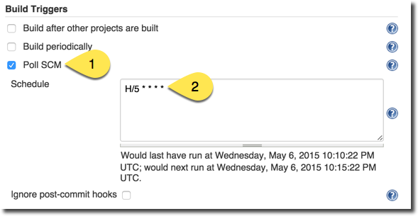

1. Under **Build**, click the Add build step dropdown and select Execute shell:

    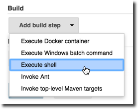

1. Paste the following command. When it runs, it will retrieve the project ID your Jenkins installation is running in, execute Packer to build GCE and Docker images, then push the Docker image to Google Container Registry and finally remove the local copy of the Docker image:

    ```shell
    #!/bin/bash
    set -e

    # Get current project
    PROJECT_ID=$(curl -s 'http://metadata/computeMetadata/v1/project/project-id' -H 'Metadata-Flavor: Google')

    # Do packer build
    packer build \
      -var "project_id=${PROJECT_ID}" \
      -var "git_commit=${GIT_COMMIT:0:7}" \
      -var "git_branch=${GIT_BRANCH#*/}" \
      packer.json

    # Push image
    gcloud preview docker push gcr.io/${PROJECT_ID}/redmine:${GIT_BRANCH#*/}-${GIT_COMMIT:0:7}

    # Remove local image
    docker rmi gcr.io/${PROJECT_ID}/redmine:${GIT_BRANCH#*/}-${GIT_COMMIT:0:7}
    ```

1. Click Save to save your job:

    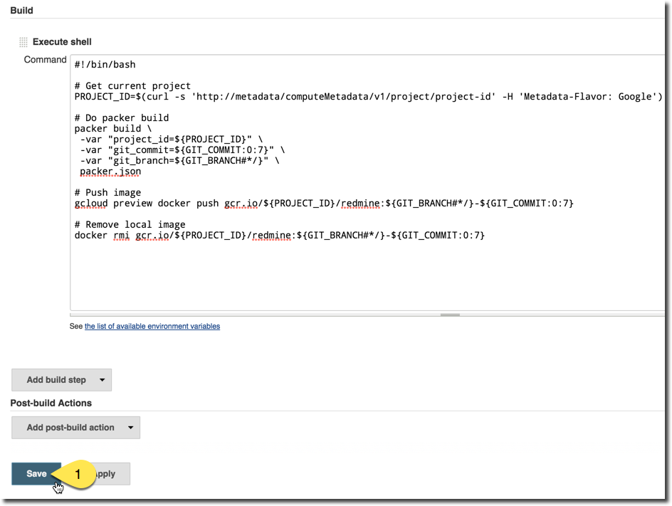

#### Run the Build
1. After saving the project, choose the **Build Now** menu item, then click the job number when it appears:

    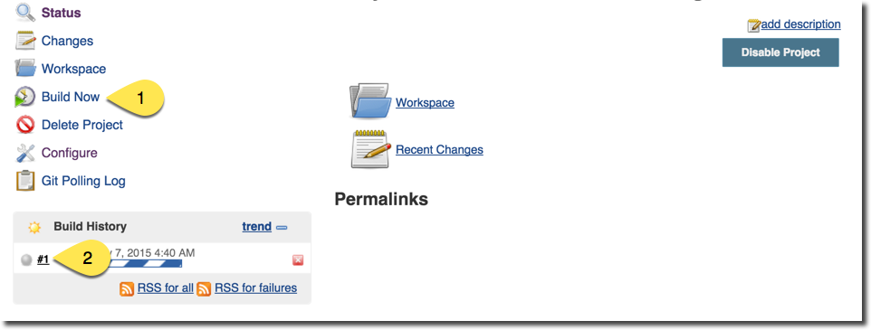

1. Choose the **Console Output** menu item and observe the job's progress:

    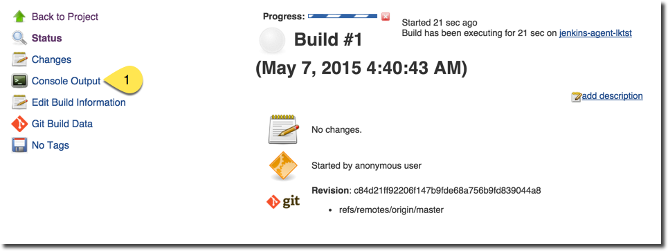

  Packer parallelizes the GCE and Docker builds. You can expect the build to take about 20 minutes; the sample build is updating the OS, building and installing Ruby, and installing the Redmine project management application and all of its gem dependencies.

1. The build is done when you see a `Finished: SUCCESS` line in the output. A few lines before that you should see the outputs (GCE and Docker iamges) of the build:

    ```shell
    ==> Builds finished. The artifacts of successful builds are:
    --> googlecompute: A disk image was created: redmine-1431028076-master-c84d21f
    --> docker: Imported Docker image: 0717053a7fce3c637a5bfd887954f41b4327e80493eb6492277e2dbb132c2bf4
    --> docker: Imported Docker image: gcr.io/your-new-project/redmine:master-c84d21f
    ...
    ...
    Finished: SUCCESS
    ```

1. In the [Google Developers Console](https://console.developers.google.com) navigate to **Compute > Images** and confirm that your GCE image for Redmine is there:

    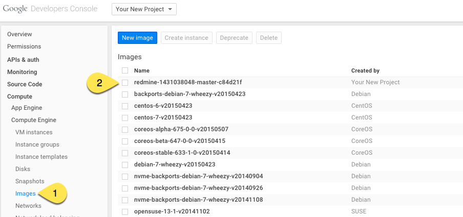

### Configure Backup
In this section you will configure Jenkins to backup your job configurations and history to Google Cloud Storage.

1. Create a bucket to store the backups in. Copy the output of the command (sample output included below):

    ```shell
    $ gsutil mb gs://jenkins-backups-$RANDOM-$(date +%s)
    Creating gs://jenkins-backups-21885-1430974383/...
    ```
1. From the Jenkins main page, click the **jenkins-gcs-backup** job, then choose the **Configure** menu item.

1. **Optional:** Adjust the build schedule to fit your needs.

1. In the Post-build Actions section, ensure your credential is selected, then edit the Storage Location field, replacing the `YOUR_GCS_BUCKET_NAME` string with the name of the bucket you created in the previous step. In the example output above, that would be `jenkins-backups-21885-1430974383`. Save your changes:

    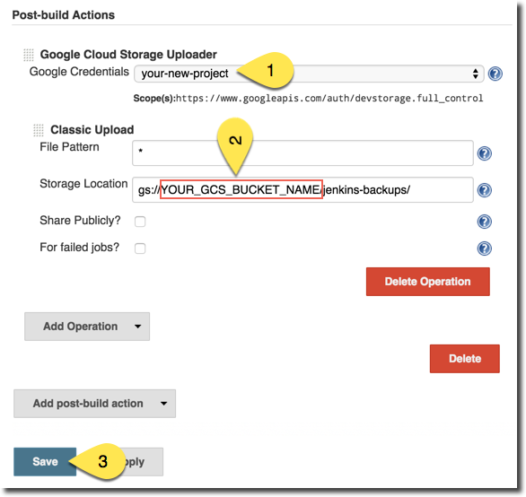

1. Click the **Build Now** menu item to run the backup. It should completely quickly, usually in just a few seconds. The blue orb indicates a successful backup:

    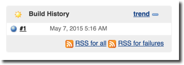

1. View the backup in the [Google Developers Console](https://console.developers.google.com) by choosing **Storage > Cloud Storage > Storage browser** in the left menu, then clicking your backup bucket in the list, and clicking into the `jenkins-backups` folder. You should see both the date-stamped and LATEST backups:

    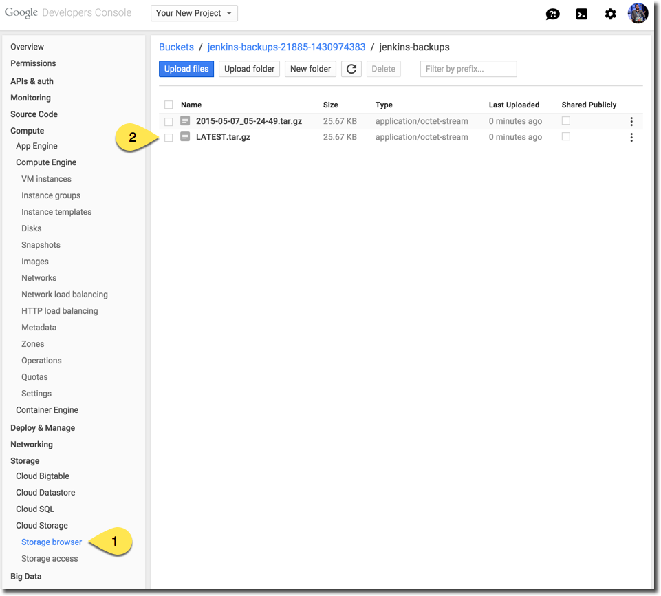

## Practice Restoring a Backup
Now that you have a Jenkins backup, you can use Kubernetes and Google Container Engine to practice restoring the backup. Here's an overview of the process, with code you can execute to complete it.

1. Create a new Replication Controller file for the leader and open it in your favorite text editor:

    ```shell
    $ cp leader.json leader-restore.json
    $ vim leader-restore.json
    ``` 
1. Add an environment variable to the pod spec pointing to the backup and rename the controller (look for the two `MODIFY THIS` tokens in the code below to see what you need to change in your file):

    ```shell
    {
      "kind": "ReplicationController",
      "apiVersion": "v1beta3",
      "metadata": {
        "name": "jenkins-leader-restored",  <--- MODIFY THIS
        "labels": {
          "name": "jenkins", "role": "leader"
        }
      },
      "spec": {
        "replicas": 1,
        "selector": {
          "name": "jenkins", "role": "leader"
        },
        "template": {
          "metadata": {
            "name": "jenkins-leader",
            "labels": {
              "name": "jenkins", "role": "leader"
            }
          },
          "spec": {
            "containers": [
                {
                  "name": "jenkins",
                  "image": "gcr.io/evanbrown-jenkins/jenkins-gcp-leader:latest",
                 "env": [
                    { 
                        "name": "GCS_RESTORE_URL",
    MODIFY THIS ---->   "value": "gs://jenkins-backups-21885-1430974383/jenkins-backups/LATEST.tar.gz"
                    }
                 ],
                 "ports": [
                   {
                     "name": "jenkins-http",
                     "containerPort": 8080
                   },
                   {
                     "name": "jenkins-discovery",
                     "containerPort": 50000
                   }
                 ]
               }
            ]
          }
        }
      }
    }  
    ```

1. Create the new Replication Controller.

    ```shell
    $ gcloud alpha container kubectl create -f leader-restore.json
    ```

1. Resize the old leader Replication Controller to 0.
  
    ```shell
    $ gcloud alpha container kubectl resize --replicas=0 replicationcontroller jenkins-leader
    ```

1. Delete the old Replication Controller and rename the new file:

    ```shell
    $ gcloud alpha container kubectl delete -f leader.json
    $ mv leader-restore.json leader.json
    ```

1. Refresh the Jenkins URL in your browser until the restored version is available. You should notice your jobs and job history restored

<a name="delete-the-deployment"></a>
## Delete the Deployment
It is very important (as mentioned in the [Very Important Things](#very-important-things) section of this document) that you delete your deployment when you are done. You will be charged for any running resources.

Whether you followed the [Quick Deploy](#quick-deploy) or [Stepwise Deploy](#stepwise-deploy) instructions, deleting resources is very easy. Simply delete the project you created at the beginning of this tutorial:

1. Navigate to the [Projects page of the Google Developer Console](https://console.developers.google.com/project), find your project, click the trash can icon to delete, then type the project ID and click Delete Project.
